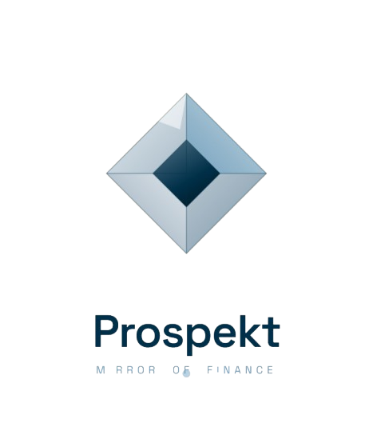

  
  
  
  # Prospekt — Mirror of Finance
  
  ### AI Destekli Davranışsal Finans Asistanı
  
  Harcamalarınızı analiz etmekten fazlasını sunan, **7 ayrı AI agent** ile çalışan kişisel finans aynanız.
  
  
  
  
  

---

## 🎯 Proje Hakkında

**Prospekt**, kullanıcıların kredi kartı ve banka ekstrelerini analiz ederek harcama davranışlarını derinlemesine anlayan, gelecek finansal vizyonlarını şekillendirmelerine yardımcı olan bir AI asistanıdır.

Çoğu finans uygulaması "ne kadar harcadığınızı" söyler. **Prospekt, "neden" harcadığınızı söyler.**

### 💡 Neden Prospekt Farklı?

- 🕵️ **Adli Muhasebeci Agent** — Harcamalarınızdaki gizli paternleri tespit eder
- 🔮 **Future Self Agent** — 5 yıl sonraki sizinle sohbet edin
- 🎲 **What-If Simülatör** — "Sigarayı bıraksam ne olur?" sorusuna somut cevap
- 🪞 **Söz Aynası** — Verdiğiniz sözleri AI takip eder, ay sonu aldatma raporunuzu çıkarır
- 🎭 **Para Kişiliği** — Karınca, Avcı, Ateşböceği, Kumarbaz veya Koruyucu — hangisisiniz?
- 🏥 **Finansal Sağlık Skoru** — 0-100 arası anlık check-up
- 🧭 **Router Agent** — Tek chat'ten 7 modüle akıllı yönlendirme

---

## 🚀 Canlı Demo

🌐 **Web:** [prospekt-app.vercel.app](https://prospekt-app.vercel.app) _(yakında)_
🎥 **Video:** [YouTube'da izle](https://youtube.com/...) _(yakında)_

---

## ✨ Öne Çıkan Özellikler

### 🤖 Multi-Agent Mimarisi

7 ayrı AI agent paralel olarak çalışır:

| Agent | Görev |
|-------|-------|
| **Router** | Kullanıcı mesajını doğru modüle yönlendirir |
| **Forensic** | Pattern detection, comparison, trigger analysis |
| **Future Self** | 5 yıl sonraki "sen" persona'sı ile sohbet |
| **What-If** | Senaryo simülasyonu + 5 yıl projeksiyonu |
| **Intention** | Söz parse + DB kayıt + ay sonu raporu |
| **Health** | 4 faktörlü finansal sağlık skoru |
| **Persona** | 5 kişilik tipinden hangisi olduğunuz |

### 🧠 Akıllı Cache Sistemi

3 katmanlı node-cache ile **token maliyeti %85 düşürüldü**:
- **Short (10dk)** — Router Agent decisions
- **Medium (30dk)** — Forensic analyses  
- **Long (1 saat)** — Health Score, Money Persona

### 📊 Halüsinasyon Önleme

AI'a sadece **yorum** yaptırılır, **hesaplama JS'de** yapılır:
- Toplam, kategori, gün dağılımı — JS deterministik
- Final cevap prompt'ına "GERÇEK VERİ" injection
- Pre-month karşılaştırma yoksa AI uydurmaz

### 📄 PDF Rapor Üretimi

Profesyonel PDF raporları:
- Dairesel skor göstergesi
- Bar chart kategori dağılımı  
- Söz tutma durumu
- Türkçe font desteği (Roboto)

---

## 🛠️ Teknoloji Stack

### Backend
- **Node.js 22** + **Express 5**
- **PostgreSQL 16** (pgvector hazır altyapı)
- **Google Generative AI** (Gemini 2.5/3.1 Flash)
- **node-cache** (multi-tier caching)
- **Zod** (schema validation)
- **PDFKit** (rapor üretimi)
- **JWT** + **bcrypt** (auth)

### Frontend
- **React 18** + **Vite**
- **Tailwind CSS**
- **Framer Motion** (animasyonlar)
- **Axios** (API client)
- **React Router v6**
- **Lucide React** (ikonlar)

### AI/ML
- **Gemini 3.1 Flash Lite** — Hızlı işlemler (routing, parsing)
- **Gemini 2.5 Flash** — Genel kullanım (chat, analysis)
- **Multi-model strategy** ile maliyet optimizasyonu

---

## 📐 Sistem Mimarisi
